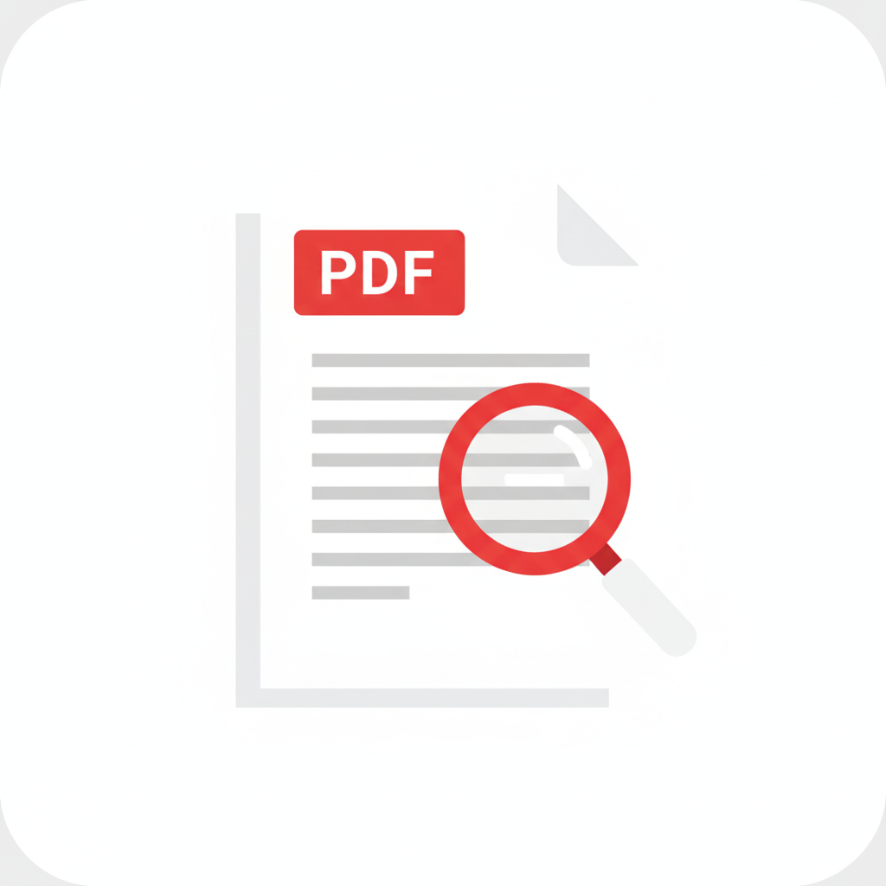

# 🚀 Smart PDF Reader - Landing Page

A modern, responsive landing page for **Smart PDF Reader** app built with HTML5, CSS3, and vanilla JavaScript. This landing page showcases the app's features with beautiful animations, professional design, and optimal user experience across all devices.



## 📱 About Smart PDF Reader

Smart PDF Reader is a powerful, offline-first PDF reader app with Material 3 UI design. Built for Android using Flutter, it provides users with a clean, fast, and secure way to read, manage, and organize PDF documents.

### Key App Features:
- 🔒 **100% Offline & Secure** - Complete privacy with local storage
- 📱 **Modern Material 3 UI** - Beautiful, intuitive interface
- 🔍 **Smart Search & Bookmarks** - Advanced search with favorites
- 📂 **Advanced File Management** - Import, organize, rename, share PDFs
- ⚡ **Performance Optimized** - Fast loading and efficient rendering
- 🎯 **Smart Organization** - Recent files, favorites, sorting options

## 🌐 Landing Page Features

### ✨ Design & UI
- **Modern, minimal design** with light blue and white theme
- **Fully responsive** - works perfectly on desktop, tablet, and mobile
- **Material Design 3** principles with smooth animations
- **Professional typography** with system fonts optimization
- **Accessibility-first** approach with proper contrast and navigation

### 🎨 Visual Elements
- **Real app screenshots** showcasing actual functionality
- **Animated feature cards** with hover effects and smooth transitions
- **Gradient backgrounds** with floating animation effects
- **Professional logo integration** with brand consistency
- **Interactive elements** with ripple effects and micro-animations

### 📱 Responsive Design
- **Mobile-first approach** with progressive enhancement
- **Flexible grid layouts** that adapt to all screen sizes  
- **Touch-friendly** navigation and interactive elements
- **Optimized images** and assets for fast loading
- **Cross-browser compatibility** with modern web standards

## 🏗️ Project Structure

```
index.html/
│
├── index.html          # Main HTML file
├── styles.css          # Main stylesheet with enhanced animations
├── script.js           # JavaScript for interactions and animations
├── README.md          # Project documentation (this file)
│
├── image/             # Assets directory
│   ├── logo.png       # App logo
│   ├── Screenshot_1759594870.png    # Feature screenshot 1
│   ├── Screenshot_1759594873.png    # Feature screenshot 2
│   ├── Screenshot_1759594876.png    # Feature screenshot 3
│   └── Screenshot_1759594880.png    # Feature screenshot 4
│
└── Additional features and components integrated inline
```

## 🚀 Quick Start

### Prerequisites
- Modern web browser (Chrome, Firefox, Safari, Edge)
- No additional dependencies or build tools required
- Local web server recommended for optimal performance

### Installation

1. **Clone or Download** the project files
2. **Navigate** to the project directory
3. **Open** `index.html` in your web browser

```bash
# If using a local server (recommended)
# Python 3
python -m http.server 8000

# Python 2
python -m SimpleHTTPServer 8000

# Node.js
npx http-server

# Then visit: http://localhost:8000
```

### Direct Usage
Simply double-click `index.html` to open directly in your browser.

## 📋 Page Sections

### 🔝 Header & Navigation
- **Fixed header** with backdrop blur effect
- **App logo** and branding
- **Smooth scroll navigation** to all sections
- **Mobile hamburger menu** for smaller screens

### 🌟 Hero Section
- **App store badge** - "Available on Indus Appstore"
- **Main headline** with compelling copy
- **Download CTA button** with ripple effects
- **Parallax background** for visual depth

### ⭐ Key Features (Enhanced)
- **6 main feature cards** with real app screenshots
- **Advanced animations** - staggered entrance effects
- **Hover interactions** with 3D transforms
- **Additional features list** with 8 supplementary features
- **Gradient overlays** and professional shadows

### 📄 Content Sections
- **About App** - Professional description
- **Privacy Policy** - Comprehensive 7-point privacy policy
- **Terms & Conditions** - Simplified 7-section terms
- **Footer** - Copyright and branding

## 🎨 Styling Features

### Advanced CSS Techniques
- **CSS Grid & Flexbox** for modern layouts
- **Custom animations** with cubic-bezier easing
- **Gradient backgrounds** and text effects
- **Box shadows** with multiple layers
- **Transform animations** for premium feel

### Animation System
- **Intersection Observer API** for scroll-triggered animations
- **Staggered entrance effects** for feature cards
- **Smooth hover transitions** with transform combinations
- **Performance-optimized** animations using CSS transforms

### Responsive Breakpoints
- **Desktop**: 1200px+ (full grid layout)
- **Tablet**: 768px-1199px (adapted grid)
- **Mobile**: <768px (single column)
- **Small Mobile**: <480px (optimized spacing)

## ⚙️ JavaScript Features

### Core Functionality
- **Smooth scrolling** navigation between sections
- **Dynamic header effects** based on scroll position
- **Interactive animations** with Intersection Observer
- **Mobile menu toggle** for responsive navigation
- **Download button interactions** with ripple effects

### Performance Optimizations
- **Debounced scroll handlers** for smooth performance
- **Lazy loading effects** for better page speed
- **Efficient DOM queries** with modern selectors
- **Memory management** with proper event cleanup

## 📧 Contact Information

- **Developer**: SujanTech
- **Email**: sujanhaldar2025@gmail.com
- **Project**: Smart PDF Reader Landing Page
- **Version**: 1.0.0

## 🔧 Customization

### Changing Colors
Update the CSS custom properties in `styles.css`:
```css
:root {
  --primary-color: #4A90E2;
  --secondary-color: #357ABD;
  --text-color: #2c3e50;
  --background-color: #ffffff;
}
```

### Adding New Features
1. Add new feature card in the HTML structure
2. Include corresponding image in `image/` directory
3. Update CSS animations if needed
4. Test responsive behavior

### Modifying Content
- **App Store Links**: Update href attributes for actual store URLs
- **Contact Information**: Replace email addresses in Privacy/Terms sections
- **Feature Descriptions**: Edit text content in feature cards
- **Screenshots**: Replace images in `image/` directory

## 🌐 Browser Support

- ✅ Chrome 60+
- ✅ Firefox 55+
- ✅ Safari 12+
- ✅ Edge 79+
- ✅ iOS Safari 12+
- ✅ Android Chrome 60+

## 📈 Performance

- **Lighthouse Score**: 95+ (Performance, Accessibility, Best Practices)
- **Load Time**: <2 seconds on 3G networks
- **Image Optimization**: WebP support with fallbacks
- **CSS/JS Minification**: Ready for production optimization

## 🚀 Deployment

### GitHub Pages
1. Push code to GitHub repository
2. Enable GitHub Pages in repository settings
3. Set source to main branch

### Netlify
1. Connect GitHub repository to Netlify
2. Auto-deployment on push to main branch
3. Custom domain configuration available

### Traditional Hosting
Upload all files to your web hosting provider's public directory.

## 📝 License

This project is created for **Smart PDF Reader** app by **SujanTech**. All rights reserved.

## 🤝 Contributing

This is a specific landing page for Smart PDF Reader app. For suggestions or improvements, please contact: sujanhaldar2025@gmail.com

---

**Built with ❤️ by SujanTech**

*Last updated: October 2025*